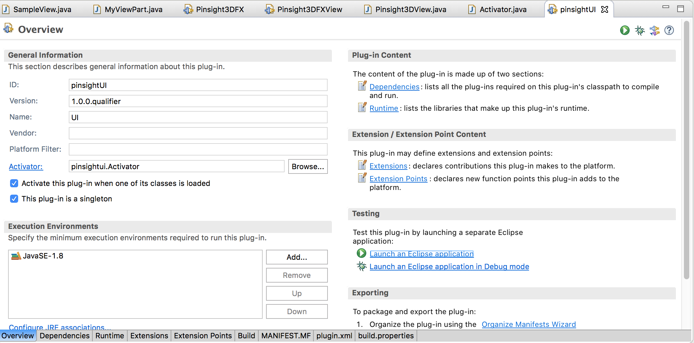
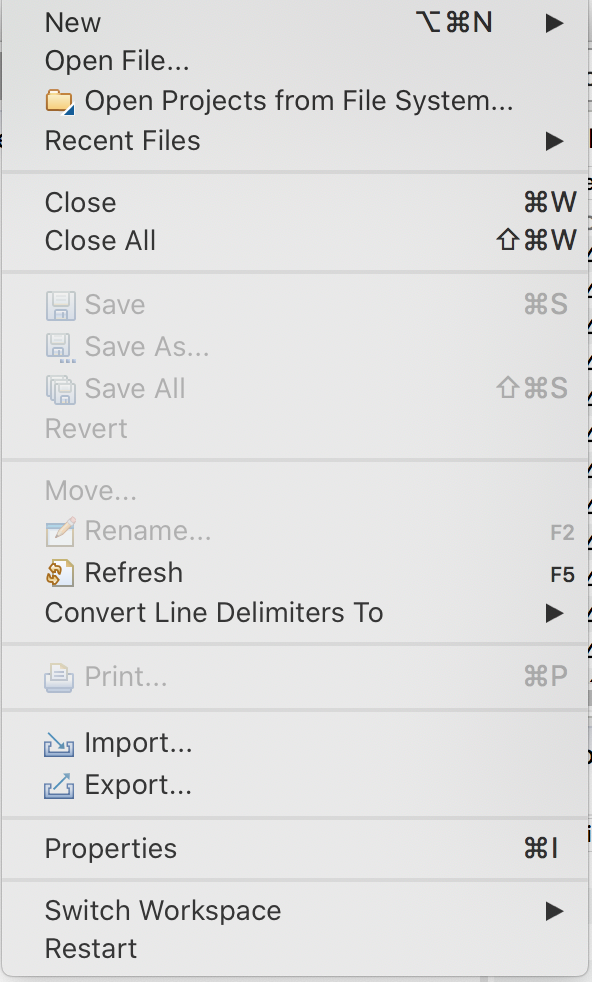
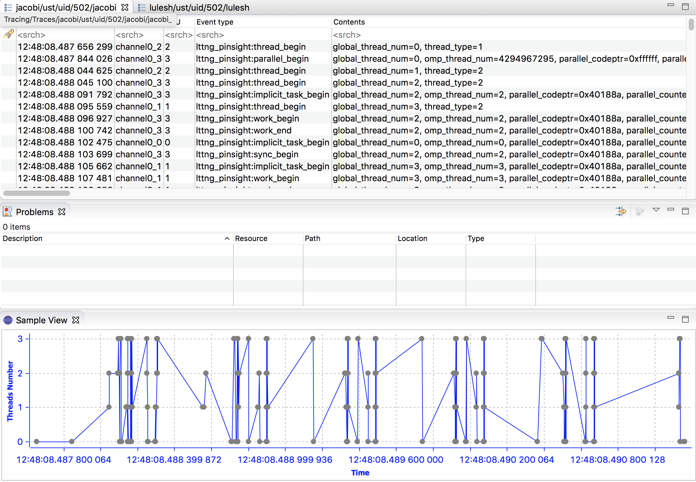

## Instructions for Starting Developing Eclipse/Tracecompass-based Visualization for PInsight

This folder contains instructions and sample files/traces to help one start developing Eclipse/Tracecompass-based visualization

### Set up tracecompass and visualize the sample data using XML data-driven view. 

1. Read the [Tracecompass overview page](https://archive.eclipse.org/tracecompass/doc/stable/org.eclipse.tracecompass.doc.user/Overview.html#Overview) to understand what Tracecompass is and what are traces, etc. 
2. Download and install [tracecompass](https://www.eclipse.org/tracecompass/). Click downloads on the webpage, download and install the version for your computer architecture and OS. For MacOS that has M chips, install the 64-bit ARM version, for Intel chips install the 64-bit x86 version. 
3. Read [Tracecompass user guide](https://archive.eclipse.org/tracecompass/doc/stable/org.eclipse.tracecompass.doc.user/User-Guide.html) to get familiar with the UI interface and their functionality. The traces you use are already generated by the tracer so you do not need to generate traces by yourself. If you are interested to know, traces are generated by a tool we developed called [PInsight](https://github.com/passlab/pinsight) using [LTTng UST](https://lttng.org/). 
4. Import the xml file [pinsight_analysis.xml](pinsight_analysis.xml) to setup pinsight data-driven analysis and visualization. The XML file is developed using a [data driven analysis solution in tracecompass](https://archive.eclipse.org/tracecompass/doc/stable/org.eclipse.tracecompass.doc.user/Data-driven-analysis.html#Data_driven_analysis) that has a screenshot for "Managing XML files containing analyses" for importing the XML file. 
5. Download the [the LULESH trace files](https://drive.google.com/drive/u/1/folders/1yWLd_ET0AwhKYFDRYfq_b9MAZmUYei_p), unpack it to a folder and open it with Tracecompass. The [Tracecompass user guide](https://archive.eclipse.org/tracecompass/doc/stable/org.eclipse.tracecompass.doc.user/Trace-Compass-Main-Features.html#Importing_Traces_to_the_Project) has screenshot how to open it. For the LULESH traces, you will need to go down to the deep of the folder and open the file named "metadata". [LULESH](https://asc.llnl.gov/codes/proxy-apps/lulesh) is a hydrodynamic simulation proxy app that has been widely used for parallel performance analysis and visualization. 

   
### Set up Eclipse IDE with Tracecompass plugin for the plugin development:
1. Download the [Eclipse IDE](https://www.eclipse.org/downloads/download.php?file=/oomph/epp/2023-06/R/eclipse-inst-jre-mac64.dmg)
2. Read [Trace compass user guide](https://archive.eclipse.org/tracecompass/doc/stable/org.eclipse.tracecompass.doc.user/User-Guide.html) to get familiar with the UI interface and their functionality
3. open eclipse installer and open the "Eclipse IDE for RCP and RAP Developers"
4. After installing> open Eclipse>Help>Install New Software. Use [this link](https://download.eclipse.org/tracecompass/releases/) to choose the right version for your installation. You will need to put the link for the repo folder, for example for 9.0.0, you choose http://download.eclipse.org/tracecompass/releases/9.0.0/repository/ as the link for the following repo for tracecompass to install the plugin: 
   

5. After the installation of tracecompass plugin, Eclipse will restart
6. After restart, create a new trace project
7. File>New>Project

8. Tracing>Tracing project
  
  
9. Read [tracecompass user guide](https://archive.eclipse.org/tracecompass/doc/stable/org.eclipse.tracecompass.doc.user/User-Guide.html) to get familiar with the UI interface and their functionality.

10. Import the xml file [pinsight_analysis.xml](pinsight_analysis.xml) to setup pinsight data-driven analysis and visualization. The XML file is developed using a [data driven analysis solution in tracecompass](https://archive.eclipse.org/tracecompass/doc/stable/org.eclipse.tracecompass.doc.user/Data-driven-analysis.html#Data_driven_analysis).

11. Open a Trace: Download [the sample trace package](https://drive.google.com/drive/u/1/folders/1yWLd_ET0AwhKYFDRYfq_b9MAZmUYei_p), unpack it and browse down to the deep of the folder and open a metadata file. 


12. Make sure to select the trace type as shown in the picture below.
    

13. You should see the following after you click the PInsight OpenMP Trace Review button deep in the Traces. You will be able to see the data like this.
    


   


### Create a plugin in Eclipse 
1. Check [the Tracecompass tutorial for creating a plugin](https://archive.eclipse.org/tracecompass/doc/stable/org.eclipse.tracecompass.doc.dev/View-Tutorial.html#Creating_an_Eclipse_UI_Plug-in). The tutorial is part of [the Tracecompass developer guide](https://archive.eclipse.org/tracecompass/doc/stable/org.eclipse.tracecompass.doc.dev/Developer-Guide.html) that also includes other features for analysis and visualization 
2. With the tutorial, have the example working to the step of creating an empty view, but not using the data provided by the example traces in the tutorial since we will need to populate the view using the provided sample trace files. The code used in the the tutorial example are outdated and we will update as we progress.
3. In your plugin view, modify the code to visualize the parallel region of the traces by analyzing the lttng_pinsight:parallel_begin and lttng_pinsight:parallel_end events for the trace you have. You can put in the bar chart for the visualization: X-axis is the parallel_codeptr, y-axis is the accumulated execution time of the parallel region. 

For example in the following code, there are two parallel regions, executed 10 and 20 times. Your traces will have a pair parallel_begin and parallle_end events for each execution of a parallel region. Thus in your analysis code, you will iterate all the traces and search the event pair, find the difference of the time-stamp of the two events, which is the execution time for each execution, and the accumulated all the execution time of the same parallel region. a parallel region is identified by parallel_codeptr event filed.

```
main() {
  for (i=0; i<10; i++) {
      //sequential region
      #pragma omp parallel num_threads(4) //parallel region 1, executed 10 times, parallel_begin event
      {
           printf("hello world, parallel region #1\n"); 
      }   //parallel_end event
     //sequential region 
   }

  for (i=0; i<20; i++) {
       //sequential region
      #pragma omp parallel num_threads(6) //parallel region 2, executed 20 times
      {
                       printf("hello world, parallel region #2\n"); 
      }
      //sequential region
  }

}
```

### Steps for launching and debugging a plugin under Eclipse (provided by Yaying), need more details. 
1. Launch Eclipse IDE and open plugin

2. Import trace data

3. Add plugin



 
